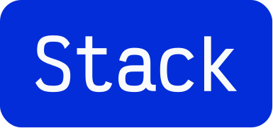

I'm a product engineer. Truthfully, I just like making things.

I'm comfortable designing interfaces, building out the frontend, or wiring up the backend. Whatever gets the thing built.

 

Currently building Avatone and Cremini! More on these soon.

If you've got an idea of any sort and you think I could help you with it, feel free to reach out!

 

Figma, Paper, Next, React, Astro, Flutter, Supabase, Pocketbase, Tauri, Unity
 
